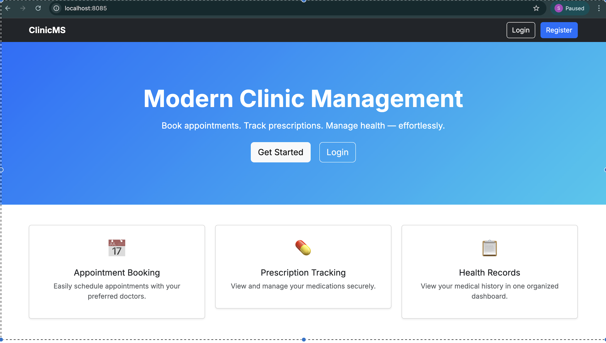

# 🚑 Patient Management System


A modern, secure **Patient Management System** built with **Spring Boot**, **Spring Security**, **Thymeleaf**, and **Spring Data JPA**.  
Designed for clinics and medical teams to manage **patients, appointments, medications, user accounts**, and database operations efficiently.

---

# ✨ Features

## 🔐 Authentication & Security
- Secure login & registration  
- BCrypt password hashing  
- Spring Security authentication flow  

## 🏥 Patient Management
- Add, edit, update, delete patients  
- View complete patient profiles  
- Medical information & history tracking  

## 📅 Appointment System
- Book appointments  
- Appointment confirmation screen  
- List all appointments  
- Postman-tested REST endpoints  

## 💊 Medication Tracking
- Add medications  
- Medication list page  
- Medication linked with patient  

## 🖥 UI & Frontend
- Thymeleaf server-rendered UI  
- Bootstrap 5 responsive layout  
- Clean, simple navigation  
- User profile dashboard  

## 🛢 Database Support
Supports multiple databases out of the box:
- **H2 (memory mode)**  
- **MySQL**  
- **PostgreSQL**  

## 🐳 Docker Support
- Pre-built Dockerfile  
- Environment variable support  
- Optional Docker Compose (included below)

---

# 📸 Screenshots

_All screenshots are stored under `/screenshots/`._

## 🏠 UI Screens

### Dashboard  


### Homepage  


### User Registration  


### Logout  


---

# 🧩 Architecture Overview

```
Patient System (Spring Boot App)
│
├── Authentication Layer
│     └── Spring Security, BCrypt
│
├── MVC Layer
│     ├── Controllers (Handle requests)
│     ├── Services    (Business logic)
│     ├── Repositories (Database access)
│     └── Models (Entities)
│
├── Thymeleaf UI Layer
│     └── HTML templates + Bootstrap 5
│
└── Database Layer
      └── H2 / MySQL / PostgreSQL
```

---

# 🛠 Project Structure

```
patient-system/
├── src/main/java/.../controller
├── src/main/java/.../service
├── src/main/java/.../repository
├── src/main/java/.../model
├── src/main/resources/
│   ├── templates/
│   └── static/
├── screenshots/
├── Dockerfile
└── README.md
```

---

# 🚀 Quick Start (Local Development)

## 1️⃣ Clone the Repo
```bash
git clone https://github.com/TheComputationalCore/patient-system.git
cd patient-system
```

## 2️⃣ Build
```bash
./mvnw clean package
```

## 3️⃣ Run with H2 (recommended for dev)
Update `application.properties`:

```
server.port=8085
spring.datasource.url=jdbc:h2:mem:patient_system
spring.datasource.driverClassName=org.h2.Driver
spring.datasource.username=sa
spring.datasource.password=
spring.jpa.hibernate.ddl-auto=update
spring.h2.console.enabled=true
spring.h2.console.path=/h2-console
spring.thymeleaf.cache=false
```

Run:

```bash
./mvnw spring-boot:run
```

Open in browser:

- App → http://localhost:8085  
- H2 Console → http://localhost:8085/h2-console  

---

# 🗄 Database Configuration

## 🐬 MySQL
```
spring.datasource.url=jdbc:mysql://localhost:3306/patient_system
spring.datasource.username=root
spring.datasource.password=your_password
spring.jpa.hibernate.ddl-auto=update
```

## 🐘 PostgreSQL
```
spring.datasource.url=jdbc:postgresql://localhost:5432/patient_system
spring.datasource.username=postgres
spring.datasource.password=your_password
spring.jpa.hibernate.ddl-auto=update
```

---

# 🐳 Docker Setup

## Build Docker Image
```bash
docker build -t patient-system:latest .
```

## Run Container
```bash
docker run -p 8085:8085 --env-file .env patient-system:latest
```

### Example `.env` file:

```
DB_URL=jdbc:mysql://localhost:3306/patient_system
DB_USERNAME=root
DB_PASSWORD=password
```

---

# 🐳 Docker Compose (Optional)

```yaml
version: "3.9"
services:
  db:
    image: mysql:8
    container_name: patient_db
    environment:
      MYSQL_ROOT_PASSWORD: root
      MYSQL_DATABASE: patient_system
    ports:
      - "3306:3306"

  app:
    build: .
    container_name: patient_app
    depends_on:
      - db
    ports:
      - "8085:8085"
    environment:
      DB_URL: jdbc:mysql://db:3306/patient_system
      DB_USERNAME: yourusername
      DB_PASSWORD: yourpassword
```

Run:
```bash
docker compose up --build
```

---

# 📘 API Documentation (Basic)

| Method | Endpoint | Description |
|--------|----------|--------------|
| GET | `/` | Home |
| GET | `/register` | Registration page |
| POST | `/register` | Register new user |
| POST | `/login` | Login user |
| POST | `/logout` | Logout user |
| GET | `/appointments` | Get all appointments |
| POST | `/appointments/book` | Book appointment |

---

# 🧪 Running Tests

```
./mvnw test
```

---

# 🤝 Contributing

See: **CONTRIBUTING.md**

---

# 🔐 Security Policy

See: **SECURITY.md**

---

# 📜 License

This project is licensed under the **MIT License**.

---

# 🏁 Release Notes

The latest stable version:  
➡ `v1.0.0 – Initial Stable Release`

---

# 👤 Author

**Dinesh Chandra — TheComputationalCore**  
GitHub: https://github.com/TheComputationalCore  
YouTube: https://www.youtube.com/@TheComputationalCore
