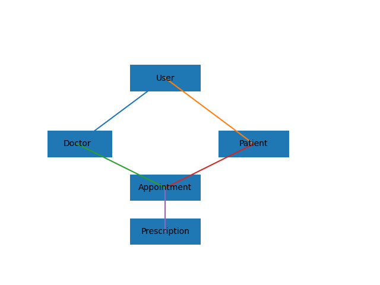
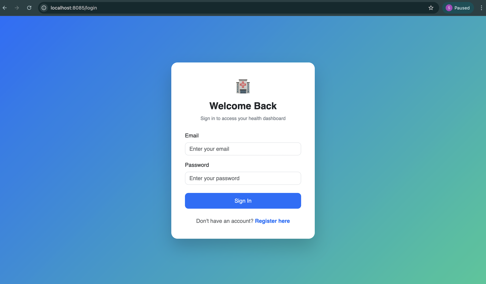
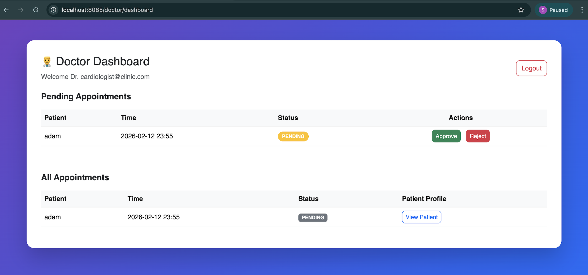
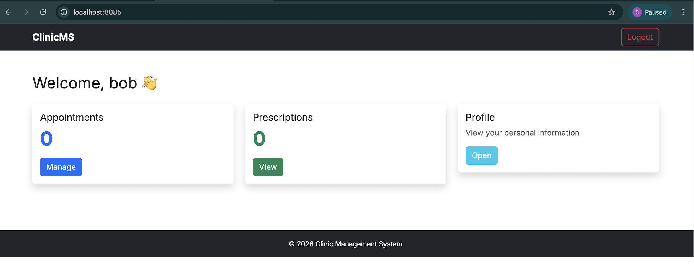
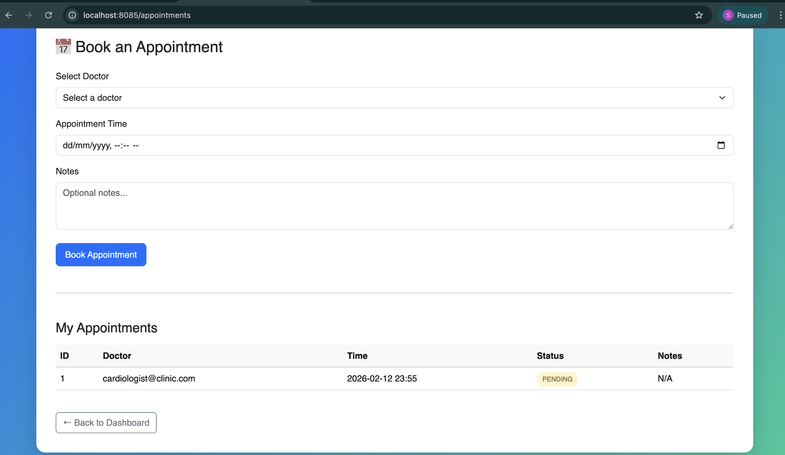

# 🏥 Clinic Management System

**Production-Grade Role-Based Healthcare Workflow Platform**
Built with Spring Boot, PostgreSQL, Docker Compose, and CI/CD
automation.


------------------------------------------------------------------------

## 🎥 System Walkthrough

📺 **YouTube Demo:**
https://youtube.com/YOUR_VIDEO_LINK_HERE

The demo covers:

-   Architectural design decisions
-   Authentication & RBAC implementation
-   Admin / Doctor / Patient workflows
-   Appointment lifecycle
-   Docker Compose orchestration
-   CI/CD pipeline overview

------------------------------------------------------------------------

# 📌 Executive Overview

The **Clinic Management System (CMS)** is a fully containerized
healthcare workflow platform designed using a layered monolithic
architecture.

It demonstrates:

-   Role-Based Access Control (RBAC)
-   Secure authentication with BCrypt
-   Appointment lifecycle management
-   Prescription workflow
-   Environment-based configuration management
-   Docker Compose orchestration (App + PostgreSQL)
-   CI/CD automation with security scanning

This is not a basic CRUD project. It reflects production-aware backend
engineering discipline.

------------------------------------------------------------------------

# 🏗 System Architecture


## Architectural Style: Layered Monolith

Client → Controller → Service → Repository → Database

### Layer Responsibilities

**Controller Layer** - Handles HTTP requests - Performs validation -
Returns Thymeleaf views

**Service Layer** - Encapsulates business logic - Enforces role
constraints - Manages transactional boundaries

**Repository Layer** - JPA/Hibernate abstraction - Database
interaction - Query management

**Security Layer** - Spring Security 6 - Role-based endpoint
authorization - CSRF protection - BCrypt password hashing

------------------------------------------------------------------------

# 🗂 Entity Relationship Model



## Core Entities

-   User
-   Doctor
-   Patient
-   Appointment
-   Prescription

### Relationship Summary

-   One Doctor → Many Appointments
-   One Patient → Many Appointments
-   One Appointment → One Prescription

------------------------------------------------------------------------

# 🖥 Application Screenshots

## 🔐 Login



## 📝 Registration


## 🧑‍💼 Admin Dashboard


Admin Capabilities: - Manage doctors - Manage patients - System-level
visibility

## ⚕️ Doctor Dashboard



Doctor Capabilities: - View appointments - Approve/reject bookings -
Create prescriptions

## 👤 Patient Dashboard



Patient Capabilities: - Book appointments - Track appointment status -
Access prescriptions

## 📅 Appointment Lifecycle



Workflow: 1. Patient submits booking request
2. Doctor reviews and approves/rejects
3. Prescription generated if applicable

------------------------------------------------------------------------

# 🛠 Technology Stack

|------------------|---------------------|
  Layer / Category   Technology
|------------------|---------------------|
  Language           Java 17
|------------------|---------------------|
  Framework          Spring Boot 3
|------------------|---------------------|
  Security           Spring Security 6
|------------------|---------------------|
  ORM                Hibernate / JPA
|------------------|---------------------|
  Database           PostgreSQL
|------------------|---------------------|
  Template Engine    Thymeleaf
|------------------|---------------------|
  Styling            Bootstrap 5
|------------------|---------------------|
  Build Tool         Maven
|------------------|---------------------|
  Containerization   Docker
|------------------|---------------------|
  Orchestration      Docker Compose
|------------------|---------------------|
  CI/CD              GitHub Actions
|------------------|---------------------|
  Static Analysis    CodeQL
|------------------|---------------------|
  Version Control    Git

------------------------------------------------------------------------

# 🐳 Containerized Application Stack (Docker Compose)

The application stack is fully containerized using Docker Compose.

It includes:

-   Spring Boot application container
-   PostgreSQL database container
-   Private Docker network
-   Persistent database volume

## ▶ Run Entire Stack

``` bash
docker compose up --build
```

Application will be available at:

http://localhost:8085

## 🛑 Stop Services

``` bash
docker compose down
```

## 🔐 Configuration Strategy

Datasource configuration is externalized using environment variables:

SPRING_DATASOURCE_URL\
SPRING_DATASOURCE_USERNAME\
SPRING_DATASOURCE_PASSWORD

Local development falls back to default values defined in
`application.properties`.

------------------------------------------------------------------------

# 🔄 Continuous Integration

On every push:

-   Maven build validation\
-   Unit test execution\
-   Docker build verification\
-   Static security analysis via CodeQL

------------------------------------------------------------------------

# 🔐 Security Design Principles

-   BCrypt password hashing\
-   Role-based authorization\
-   CSRF protection enabled\
-   Secure session handling\
-   Automated vulnerability scanning

------------------------------------------------------------------------

# 🧪 Testing Strategy

Run tests locally:

``` bash
mvn test
```

Includes:

-   Service-layer unit tests\
-   Business rule validation\
-   Repository mocking via Mockito

------------------------------------------------------------------------

# 📁 Project Structure

    clinic-management-system/
    │
    ├── .github/workflows/
    │   ├── ci.yml
    │   └── codeql.yml
    │
    ├── src/main/java/com/thecomputationalcore/cms/
    │   ├── config/
    │   ├── controller/
    │   ├── service/
    │   ├── repository/
    │   ├── security/
    │   └── model/
    │
    ├── src/main/resources/
    │   ├── templates/
    │   ├── static/
    │   └── application.properties
    │
    ├── architecture_diagram.svg
    ├── er_diagram.png
    ├── screenshots/
    ├── Dockerfile
    ├── docker-compose.yml
    └── pom.xml

------------------------------------------------------------------------

# 📈 Engineering Evolution

Originally derived from:
``` bash
https://github.com/TheComputationalCore/patient-system
```
Major Enhancements:

-   Multi-role RBAC system
-   Admin dashboard implementation
-   Appointment lifecycle workflow
-   Docker Compose orchestration
-   CI/CD integration
-   Security improvements
-   Structural refactoring

------------------------------------------------------------------------

# 🚀 Future Enhancements

-   REST API layer
-   Swagger/OpenAPI documentation
-   JWT-based authentication
-   Cloud deployment (AWS/GCP)
-   Observability & monitoring
-   Audit logging

------------------------------------------------------------------------

# 📜 License

MIT License © 2025 TheComputationalCore

------------------------------------------------------------------------

# 💼 Recruiter Summary

This project demonstrates:

-   Clean layered backend architecture
-   Secure authentication & RBAC
-   Relational database modeling
-   Containerized infrastructure design
-   CI/CD discipline
-   Production-conscious configuration management
-   Clean Git workflow practices

Designed and implemented with engineering maturity in mind.
