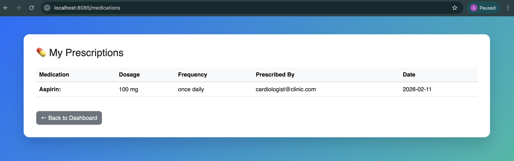

```{=html}
<p align="center">
```
```{=html}
<h1 align="center">
```
🏥 Clinic Management System
```{=html}
</h1>
```
```{=html}
<h3 align="center">
```
Enterprise-Grade Role-Based Medical Management Platform
```{=html}
</h3>
```
```{=html}
<p align="center">
```
Built with Spring Boot 3 • Spring Security • PostgreSQL • Thymeleaf •
Hibernate
```{=html}
</p>
```
```{=html}
</p>
```

------------------------------------------------------------------------

```{=html}
<p align="center">
```
``{=html}
``{=html}
``{=html}
``{=html}
``{=html}
``{=html}
```{=html}
</p>
```

------------------------------------------------------------------------

# 🚀 Overview

**Clinic Management System** is a secure, scalable, full-stack web
application designed for managing:

-   👨‍⚕️ Doctors
-   🧑 Patients
-   📅 Appointments
-   💊 Prescriptions
-   🔐 Authentication & Authorization

This project follows **industry-level architecture standards** and
implements **Role-Based Access Control (RBAC)** using Spring Security.

------------------------------------------------------------------------

# 🏗️ Enterprise Architecture

    Controller Layer
            ↓
    Service Layer (Business Logic)
            ↓
    Repository Layer (JPA)
            ↓
    PostgreSQL Database

### Architectural Highlights

✔ Layered architecture\
✔ Separation of concerns\
✔ Clean transactional boundaries\
✔ DTO-safe entity handling\
✔ Secure password encryption (BCrypt)\
✔ CSRF Protection\
✔ Production-ready configuration

------------------------------------------------------------------------

# 🔐 Security Architecture

### Authentication Flow

1.  User submits email + password\
2.  Spring Security validates credentials\
3.  Password compared using BCrypt\
4.  Role loaded from database\
5.  Role-based redirect executed

### Role-Based Access

  Role           Capabilities
  -------------- ----------------------------------------
  ROLE_ADMIN     Manage doctors & patients
  ROLE_DOCTOR    Manage appointments & prescribe
  ROLE_PATIENT   Book appointments & view prescriptions

------------------------------------------------------------------------

# 🧩 Core Features

## 👨‍💼 Admin

-   Dashboard analytics
-   Add professional doctors
-   Delete doctors
-   View & delete patients
-   System settings

## 👨‍⚕️ Doctor

-   View assigned appointments
-   Approve / reject appointments
-   Prescribe medications
-   View patient details

## 🧑 Patient

-   Secure registration
-   Book appointments
-   View appointment history
-   View prescriptions
-   Manage profile

------------------------------------------------------------------------

# 🗄️ Database Design (Professional Relational Model)

### Users (Authentication Table)

    id (PK)
    email (unique)
    password (BCrypt)
    role

### Doctors

    id (PK)
    name
    specialization
    contact
    user_id (FK)

### Patients

    id (PK)
    name
    phone
    medical_history
    user_id (FK)

### Appointments

    id (PK)
    appointment_time
    status (ENUM)
    notes
    doctor_id (FK)
    patient_id (FK)

### Medications

    id (PK)
    name
    dosage
    frequency
    prescribed_date
    doctor_id (FK)
    patient_id (FK)

------------------------------------------------------------------------

# 🖥️ UI Preview

## 🏠 Homepage


## 🔐 Login


## 🧑 Registration


## 👨‍💼 Admin Dashboard


## 👨‍⚕️ Doctor Dashboard


## 🧑 Patient Dashboard


## 📅 Appointment Booking


## 💊 Prescriptions



------------------------------------------------------------------------

# ⚙️ Tech Stack

  Layer        Technology
  ------------ -------------------
  Backend      Spring Boot 3
  Security     Spring Security
  ORM          Hibernate / JPA
  Database     PostgreSQL
  Frontend     Thymeleaf
  Styling      Bootstrap 5
  Build Tool   Maven
  Testing      JUnit 5 + Mockito

------------------------------------------------------------------------

# 🧪 Testing Strategy

✔ Unit tests with Mockito\
✔ Service layer validation tests\
✔ Mocked repository interactions\
✔ Context load verification

Run tests:

    ./mvnw test

------------------------------------------------------------------------

# 🐳 Deployment & DevOps

## Docker Support

    docker build -t clinic-management-system .
    docker run -p 8085:8085 clinic-management-system

## Production Ready Config

-   Externalized DB config
-   Environment variable support
-   Open-in-view disabled
-   SQL logging configurable

------------------------------------------------------------------------

# 📈 Project Strengths

✔ Clean architecture\
✔ Enterprise RBAC security\
✔ Professional UI\
✔ Proper entity relationships\
✔ Production-grade configuration\
✔ Industry-aligned standards\
✔ Resume-ready backend project

------------------------------------------------------------------------

# 👨‍💻 Author

**Dinesh Chandra**\
GitHub: https://github.com/TheComputationalCore\
YouTube: https://www.youtube.com/@TheComputationalCore

------------------------------------------------------------------------

# 📜 License

MIT License

------------------------------------------------------------------------

```{=html}
<p align="center">
```
Built with ❤️ using Spring Boot & Modern Java
```{=html}
</p>
```
